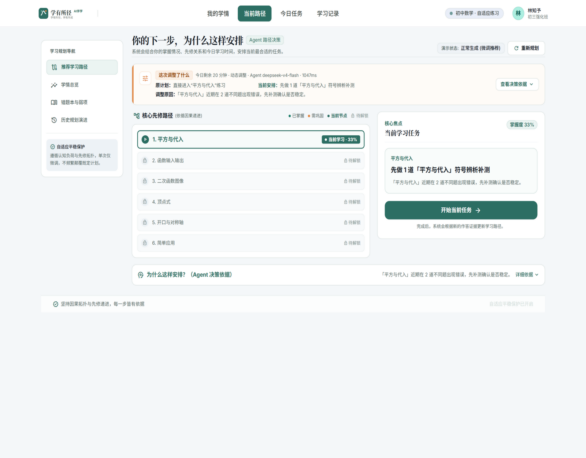
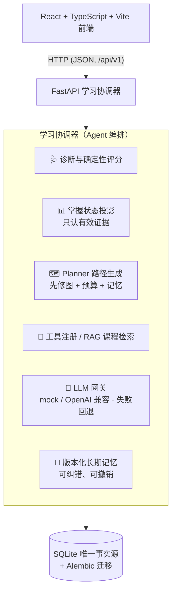
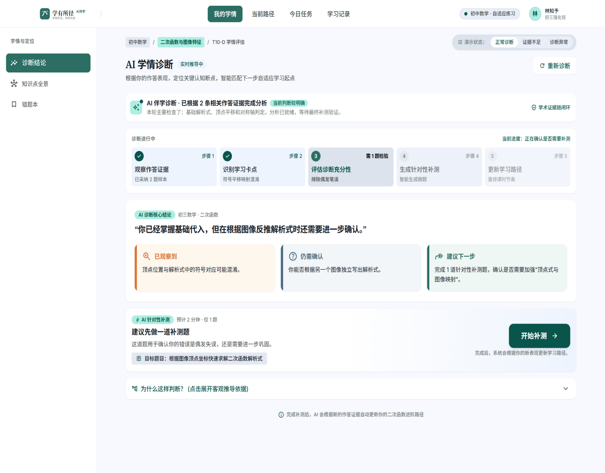
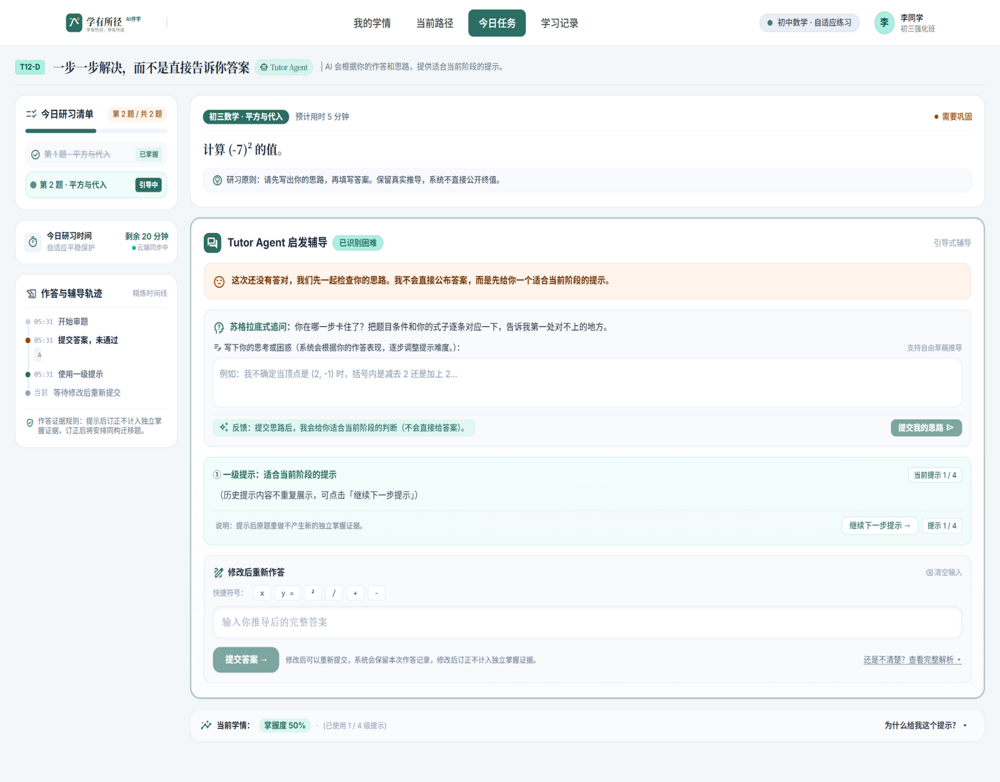
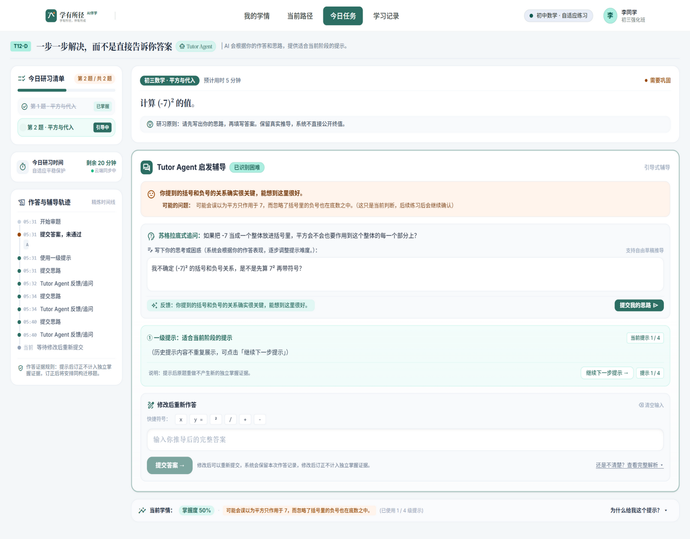

<div align="center">

# 🎓 学有所径，伴有所成

**具备学情诊断与持续规划能力的自适应伴学智能体**

[](https://www.python.org/)
[](https://fastapi.tiangolo.com/)
[](https://react.dev/)
[](https://www.typescriptlang.org/)
[](backend/tests)

它能够解释：**你现在适合学什么、为什么、遇到困难怎么办，以及上次的学习如何影响今天的安排。**



*当前路径页：每一步安排都展示 Agent 的决策依据、本次调整原因与先修因果链。*

</div>

---

## ✨ 核心功能

学有所径是一个以「有效证据」为核心的自适应伴学系统：掌握度只认"独立、无提示、首答"的正确作答，提示后答对会如实标记为"辅助完成"，不虚增掌握。首版聚焦一个学生、一个数学专题（初中二次函数：约 6 个知识点、300 道人工核验题），未来通过课程包扩展学科。

- 🩺 **AI 学情诊断** — 通过初筛题定位起点，输出"已观察到 / 仍需确认 / 建议下一步"的结构化结论；未测试的知识点如实显示"尚未评估"，跳过不算答错，中断后可继续。
- 🗺️ **自适应路径规划** — Planner 综合知识点先修关系、当前掌握度、每日时间预算、未完成任务与长期记忆，生成可解释的学习路径；新的有效证据自动触发重算，并展示"这次调整了什么"。
- 👩‍🏫 **脚手架式辅导** — 答错先给分层提示，再由 Tutor Agent 以苏格拉底式追问引导学生自己想通，而不是直接给答案；完整保留"提交答案 → 提示 → 追问 → 修正"的辅导轨迹。
- 🔍 **基于课程资料的 RAG 讲解** — 概念讲解经过查询改写、课程过滤与重排，只引用真实课程资料并标注来源，检索分数不作为学生能力。
- 🔬 **迁移验证** — 只有在新题上独立作答正确，才产生新的掌握证据（按题族去重，防止重复刷题虚增掌握）。
- 🧠 **可审计的反思与长期记忆** — 自动生成"已掌握 / 待巩固 / 下次建议"小结并附证据编号；记忆版本化存储、可纠错、可撤销，被标记不准确的记忆自动排除出后续规划。
- 🏅 **真实事件成就激励** — 25 枚徽章全部由真实学习事件计算，未达成不返回核发证据；任务奖励与匿名排行榜。
- 🎭 **可重复演示** — 内置 mock 模型提供者，离线即可完整跑通学习闭环；切换真实大模型后，模型 / 检索 / 记忆失败均有结构化回退，前端顶栏实时显示当前运行模式。

## 🏗️ 系统架构



一次完整的学习闭环：

> 诊断 → 生成路径 → 讲解与练习 → 答错干预（提示 / 追问 / RAG 讲解）→ 原题修正（辅助完成）→ 迁移题独立验证 → 反思小结与记忆沉淀 → 证据触发再规划

## 🚀 快速开始

前置：[uv](https://docs.astral.sh/uv/)（Python 3.12 由 uv 托管）、Node 20+。

```bash
git clone https://github.com/ZQR1101/xueyoujing-companion.git
cd xueyoujing-companion

# ① 环境配置：复制样例并按需修改（.env 不提交）
cp .env.example .env
```

**② 启动后端**（默认 mock 模型，离线可跑通全部闭环）

```bash
cd backend
uv sync                                          # 安装依赖（锁定于 uv.lock）
uv run alembic upgrade head                      # 建表
uv run python ../../scripts/import_curriculum.py # 导入课程包（幂等）
uv run uvicorn app.main:app --host 127.0.0.1 --port 8000
```

探活：`GET /healthz`；就绪详情（课程规模 / RAG 索引 / 模型模式）：`GET /readyz`。

**③ 启动前端**（另开一个终端）

```bash
cd frontend
npm install
npm run dev    # http://localhost:5174（5173 已留给其他项目）
```

**④ （可选）连接真实大模型**：把 `.env` 中的 `LLM_PROVIDER` 改为 `openai`，填入 `LLM_BASE_URL` / `LLM_MODEL_ID` / `LLM_API_KEY`（附 DeepSeek 示例，见 `.env.example` 内注释）。前端如需自定义 API 地址，在 `frontend/.env` 配置 `VITE_API_BASE_URL`。

## 📖 探索学有所径

### 🩺 AI 学情诊断

根据已提交的作答证据定位关键认知断点，实时推进五步诊断流程，并给出带依据的结构化结论与针对性补测建议——补测用于区分"偶发失误"与"需要巩固"，而不是给能力贴标签。



### 👩‍🏫 引导式辅导工作台

答错不直接公布答案：Tutor Agent 先用苏格拉底式追问引导学生写出思路，再给适合当前阶段的一级提示；右侧完整记录作答与辅导轨迹，并明示证据规则——提示后订正不计入独立掌握，订正后将安排同构迁移题做独立验证。





## ⌨️ 常用命令

| 命令 | 说明 |
|---|---|
| `cd backend && uv run pytest -q` | 后端全量测试（当前 123 项） |
| `cd frontend && npm run build` | 前端类型检查 + 生产构建 |
| `cd frontend && npm run lint` | 前端 lint（oxlint） |
| `python scripts/demo_preflight.py` | 演示前只读预检 `/healthz` 与 `/readyz`，不发送模型请求 |
| `cd backend && uv run python ../../scripts/import_curriculum.py` | 重新导入课程包（幂等） |

## 📁 目录结构

```text
backend/          FastAPI + SQLAlchemy + SQLite（uv 管理依赖）
  app/api/            HTTP 路由、DTO、幂等与统一错误封装
  app/services/       学习协调、诊断、规划、辅导、反思等业务逻辑
  app/domain/         领域模型与纯计算（掌握度、先修图、评分）
  app/infrastructure/ 数据库、LLM 网关、RAG 索引、课程导入
  alembic/            数据库迁移
  tests/              pytest 全量测试
frontend/         React 19 + TypeScript + Vite
  src/pages/          学情、诊断、路径、辅导工作台、成就等页面
curriculum/       课程包：二次函数知识点、核验题库、讲解资料
docs/             规格书、API 合同、交付记录、演示与商业化文档
scripts/          课程导入、题库生成、演示预检
```

## 📚 项目文档

- [独立项目开发规格书 v2](docs/学有所径_独立项目开发规格书_v2.md) —— 产品与工程设计全文
- [API 合同 v1.2](docs/API合同_v1.2.md)（[增补 T10–T14](docs/API合同_增补_T10-T14.md)）—— 接口基线
- [比赛验收与演示脚本](docs/比赛验收与演示脚本.md) —— 3～5 分钟现场演示流程
- [商业化与落地方案](docs/商业化与落地方案.md) —— 部署形态与验证指标
- [工单交付记录](docs/) —— 各阶段实施与验证记录

## 🧭 范围与声明

- 掌握度只认"独立、无提示、首答"的有效证据（按题族 `family_id` 去重）；检索相关性分数不得作为学生能力。
- 未经过教学实验验证的规则统一称为"启发式策略"，不宣称已验证的学习效果；积分与徽章不等同于掌握度。
- 本项目与 `ai-agent-study-assistant` 相互独立：不共享运行数据、不引用其代码、不复制其凭据，原项目仅作只读参考。

## 🙏 致谢

项目设计早期参考了 [DeepTutor](https://github.com/HKUDS/DeepTutor)（HKUDS）公开介绍的统一运行时、掌握路径与分层记忆思想；本项目未复制其源代码，全部实现为独立完成。
